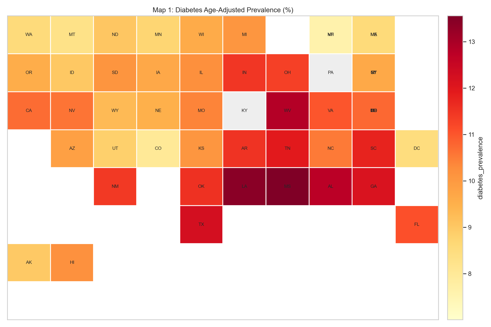
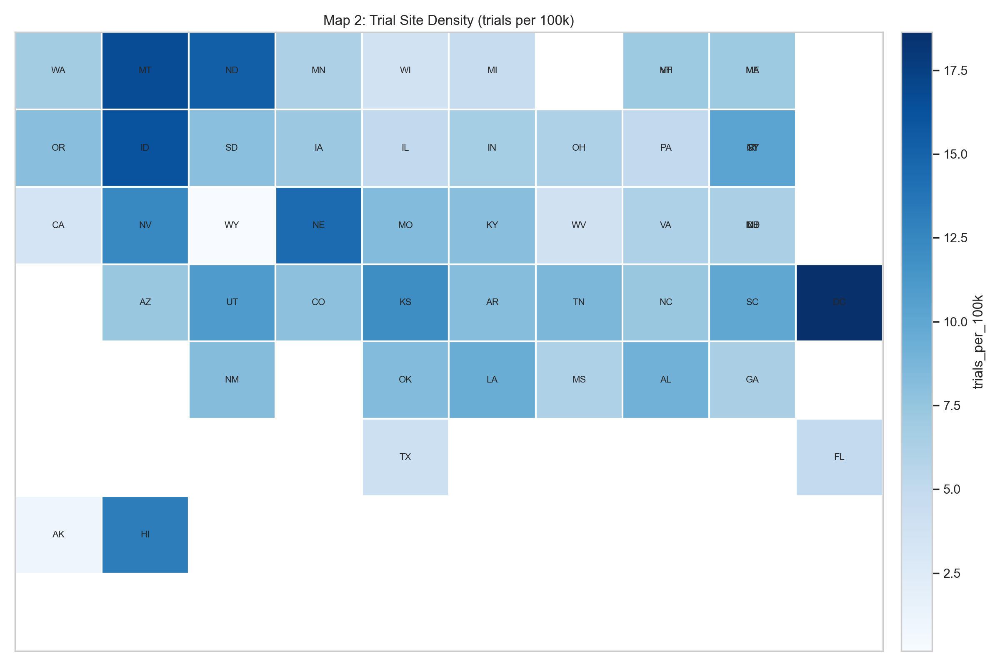
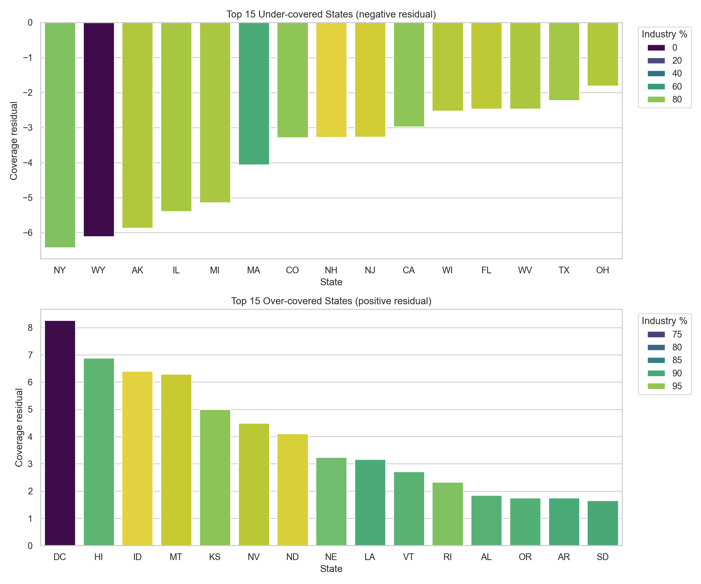
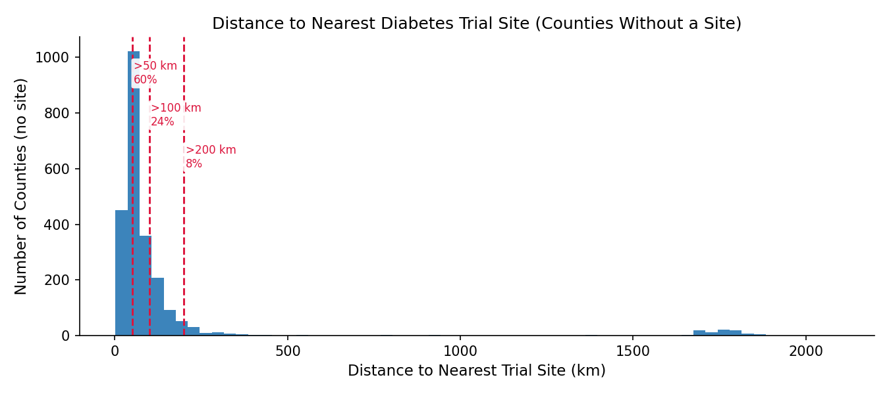
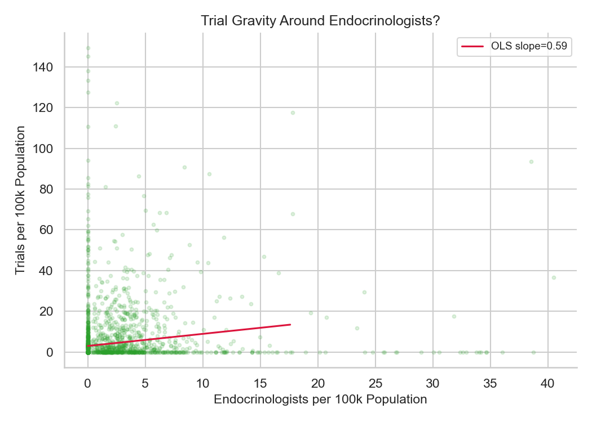

# Introduction

## Background and Motivation
Diabetes mellitus represents a major public health crisis in the United States, exhibiting profound geographic and socioeconomic disparities (Barker et al., 2011). Socioeconomic status, including factors such as poverty, education, and health insurance, plays a critical role in the prevalence and management of the disease (Hill-Briggs et al., 2021). As the medical industry continues to develop innovative treatments for Type 2 diabetes, a paradox remains: the opportunities to participate in clinical trials are not distributed equitably across the national geography. Clinical trial locations are frequently driven by institutional infrastructure and socioeconomic environments, creating a spatial mismatch that systematically excludes vulnerable, rural, and high-burden populations from research (Tanner et al., 2015; Unger et al., 2019). This lack of access often manifests in the form of physical travel barriers and a lack of local trial availability, directly limiting the generalizability of clinical research (Kirkwood et al., 2024). 

## Research Question and Hypothesis
Therefore, the research question is: "To what extent do county-level diabetes clinical trial access and county socioeconomic conditions jointly predict county-level diabetes burden in the United States? Specifically, are diabetes clinical trial sites concentrated in counties with greater diabetes burden, or are they more strongly associated with county socioeconomic advantage and local research capacity?"

We hypothesize that diabetes clinical trial geography is not aligned with disease burden; rather, trial placement primarily tracks structural advantage, favorable socioeconomic conditions, and the presence of academic medical infrastructure.

# Methods

## Data Acquisition
The full dataset was collected exclusively via programmatic API pulls and web scraping to compile a multi-dimensional, county-level dataset of the United States, completely avoiding the use of standalone Kaggle datasets. We obtained four types of data and merged them into a single dataset for analysis: (1) diabetes clinical trial access data from ClinicalTrials.gov, (2) county-level diabetes burden data from CDC sources, (3) county-level socioeconomic data from the American Community Survey (ACS), and (4) county-level healthcare infrastructure proxies from the National Provider Identifier (NPI) registry, including endocrinologist density and academic medical center presence.

## Data Cleaning and Wrangling
The raw nested JSON payloads from ClinicalTrials.gov were flattened into separate trial-level and site-level records. Because the clinical trial data provided city/state locations rather than standard identifiers, we used the 2022 Census Gazetteer combined with the FCC Census API (reverse geocoding latitude/longitude to FIPS codes) to accurately map trial sites to 5-digit County FIPS codes. To measure geographic isolation, we calculated the straight-line distance (using the Haversine formula and scipy.spatial.cKDTree) from each county's population centroid to the nearest clinical trial site. All datasets were merged on the County FIPS code. Missing values for core modeling features were handled via complete-case analysis. Highly skewed variables (e.g., total population, trial distance, and trial density) were log-transformed (log1p or log) to normalize distributions.

The EDA steps and feature engineering were conducted using pandas and numpy. Correlation heatmaps and distributions were visualized using seaborn and matplotlib. For predictive modeling, we utilized scikit-learn to apply standard scaling and build baseline Elastic Net regression models with 5-fold cross-validation. Advanced gradient boosting techniques (xgboost) were subsequently applied to capture non-linear relationships.

# Preliminary Results
The data pipeline aggregated 3,646 U.S. Type 2 diabetes studies and 47,118 site records. The descriptive results already point to a clear preliminary pattern: diabetes trial availability is geographically concentrated, does not scale smoothly with disease burden, and appears to cluster around research capacity more than around burden alone. These results are still exploratory, but they provide a strong rationale for the formal county-level modeling stage.

## State-Level Burden and Trial Density Do Not Line Up Cleanly

::: {.columns}
::: {.column width="50%"}
{width=100%}
:::
::: {.column width="50%"}
{width=100%}
:::
:::

Figure 1 shows the central descriptive mismatch. States with heavier diabetes burden are not automatically the states with denser trial availability. The diabetes belt remains visible in the South and Appalachia, but the trial-density map is more fragmented and includes several smaller, infrastructure-rich states that do not rank among the highest-burden areas. This visual divergence motivates a more explicit comparison between observed and expected trial density.

To formalize that mismatch, I computed a state-level coverage residual: observed trial density minus the trial density expected for a state's diabetes-burden decile. Negative values indicate under-coverage relative to peer states with similar burden, while positive values indicate over-coverage.

{width=100%}

The residual analysis sharpens the map comparison. Some high-burden or moderately high-burden states remain clearly under-covered relative to peer states, while several Mountain Plains and small-jurisdiction states appear over-covered. Sponsor composition is also concentrated: nationally, industry-sponsored trial density is 5.39 trials per 100k population versus 0.78 for non-industry trials, so industry density is about 6.9 times higher. That pattern suggests site placement is shaped by sponsor and infrastructure logistics, not just public-health need.

**Table 1. Five most under-covered states relative to diabetes burden**

| State | Trial count | Site count | Trials per 100k | Coverage residual | Industry share (%) |
|---|---:|---:|---:|---:|---:|
| WY | 1 | 1 | 0.17 | -8.58 | 0.0 |
| AK | 8 | 9 | 1.09 | -7.66 | 87.5 |
| NH | 98 | 103 | 7.10 | -5.11 | 96.9 |
| WI | 221 | 285 | 3.76 | -4.50 | 88.2 |
| CO | 458 | 685 | 7.94 | -4.28 | 80.8 |

**Table 2. Five most over-covered states relative to diabetes burden**

| State | Trial count | Site count | Trials per 100k | Coverage residual | Industry share (%) |
|---|---:|---:|---:|---:|---:|
| ID | 301 | 376 | 16.23 | 7.48 | 99.7 |
| ND | 119 | 132 | 15.32 | 6.57 | 99.2 |
| DC | 125 | 136 | 18.64 | 6.43 | 70.4 |
| NE | 283 | 404 | 14.45 | 6.19 | 92.6 |
| KS | 351 | 475 | 11.96 | 4.92 | 94.6 |

Together, Figure 1, Figure 2, and Tables 1-2 show that the project is not simply describing low access everywhere. Instead, it is identifying a patterned allocation problem: some places are substantially under-supplied relative to their burden, while others receive disproportionately dense trial coverage.

## County-Level Access Gaps Are Large

State summaries still hide the lived access problem because most counties do not host a trial site at all. The county file retains 3,221 counties. Only 856 counties (26.6%) host at least one diabetes trial site, while 2,365 counties (73.4%) have none.

**Table 3. County-level access summary**

| Metric | Value |
|---|---:|
| Counties in final county file | 3,221 |
| Counties with at least one trial site | 856 (26.6%) |
| Counties without a trial site | 2,365 (73.4%) |
| Median nearest-site distance among no-site counties | 58.4 km |
| Share of no-site counties more than 50 km away | 59.7% |
| Share of no-site counties more than 100 km away | 24.0% |
| Share of no-site counties more than 200 km away | 8.2% |

{width=100%}

This figure shows that the access problem is not marginal. For counties without a site, travel distance is often substantial rather than trivial. That pattern matters for the research question because a state can look moderately well-covered in aggregate while still leaving most of its counties without feasible local trial access.

## Preliminary Evidence Points Toward Structural Concentration

The descriptive evidence also suggests that trial geography may be linked to clinical research capacity. Counties with more endocrinologists tend to have higher trial density, which is consistent with the idea that trial sites cluster around specialty-care ecosystems rather than around burden alone.

{width=85%}

This relationship does not establish causality, but it is exactly the pattern that motivates the final modeling plan. If trial access is largely an infrastructure phenomenon, then county-level models should show that provider capacity, socioeconomic advantage, and related contextual variables explain more of the variation in diabetes burden and trial geography than trial counts alone.

# Summary
The preliminary descriptive results support the project hypothesis, but they do not yet settle it. Trial availability is clearly concentrated, many counties remain physically distant from the nearest diabetes trial site, and the strongest descriptive relationships so far point toward infrastructure and sponsor concentration rather than burden matching. At the same time, these are still bivariate and descriptive patterns. They cannot tell us whether trial-access variables retain an independent association with diabetes burden once poverty, insurance, education, race and ethnicity, rurality, internet access, and provider infrastructure are considered jointly.

That gap is precisely why the next stage of the project matters. For the final deliverable, the plan is:
1. Fit county-level multivariable models to quantify the joint contribution of trial access, socioeconomic disadvantage, and healthcare infrastructure to diabetes burden.
2. Compare linear and non-linear models, then use SHAP-based attribution on the best-performing model to determine which predictor blocks are actually driving the results.
3. Translate those findings into an interactive public-facing product that lets users identify counties and states where burden, access, and infrastructure are most misaligned.

# References

Barker, L. E., Kirtland, K. A., Gregg, E. W., Geiss, L. S., & Thompson, T. J. (2011). Geographic distribution of diagnosed diabetes in the U.S.: A diabetes belt. American Journal of Preventive Medicine, 40(4), 434–439. https://doi.org/10.1016/j.amepre.2010.12.019

Hill-Briggs, F., Adler, N. E., Berkowitz, S. A., Chin, M. H., Gary-Webb, T. L., Navas-Acien, A., Thornton, P. L., & Haire-Joshu, D. (2021). Social determinants of health and diabetes: A scientific review. Diabetes Care, 44(1), 258–279. https://doi.org/10.2337/dci20-0053

Kirkwood, M. K., Schenkel, C., Hinshaw, D. C., Bruinooge, S. S., Waterhouse, D. M., Peppercorn, J. M., Subbiah, I. M., & Levit, L. A. (2024). State of geographic access to cancer treatment trials in the United States: Are studies located where patients live? JCO Oncology Practice, 20(3), 427–437.

Tanner, A., Kim, S. H., Friedman, D. B., Foster, C., & Bergeron, C. D. (2015). Barriers to medical research participation as perceived by clinical trial investigators: Communicating with rural and African American communities. Journal of Health Communication, 20(1), 88–96. https://doi.org/10.1080/10810730.2014.908985

Unger, J. M., Vaidya, R., Hershman, D. L., Minasian, L. M., & Fleury, M. E. (2019). Systematic review and meta-analysis of the magnitude of structural, clinical, and physician and patient barriers to cancer clinical trial participation. Journal of the National Cancer Institute, 111(3), 245–255.
